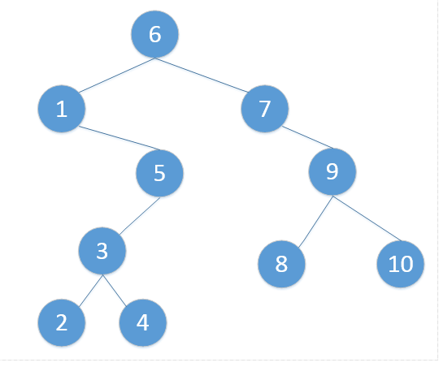

#### 前驱结点:结点值小于查找结点值的集合中最大值的结点。
#### 后继结点:结点值大于查找结点值的集合中最小值的结点。

## 查找方法

-----------------------分割线-----------------------------------------
### 前驱结点
1.若一个节点有左子树，那么该节点的前驱节点是其左子树中val值最大的节点
2.若一个节点没有左子树，那么判断该节点和其父节点的关系 
2.1 若该节点是其父节点的右边孩子，那么该节点的前驱结点即为其父节点。 
2.2 若该节点是其父节点的左边孩子，那么需要沿着其父亲节点一直向树的顶端寻找，直到找到一个节点P，P节点是其父节点Q的右边孩子（可参考例子2的前驱结点是1），那么Q就是该节点的前驱节点（按参考例子P结点为5，Q结点为1，P结点是Q结点的右边的孩子），所以Q1就是2结点的前驱节点

### 后继结点
1.若一个节点有右子树，那么该节点的后继节点是其右子树中val值最小的节点
2.若一个节点没有右子树，那么判断该节点和其父节点的关系 
2.1 若该节点是其父节点的左边孩子，那么该节点的后继结点即为其父节点。 
2.2 若该节点是其父节点的右边孩子，那么需要沿着其父亲节点一直向树的顶端寻找，直到找到一个节点P，P节点是其父节点Q的左边孩子（可参考例子2的前驱结点是1），那么Q就是该节点的后继节点

## 原文:https://blog.csdn.net/I_love_blog/article/details/60343787
